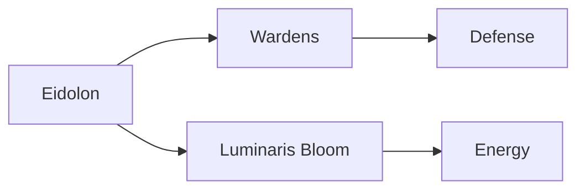

# Eidolon Line Lore Wiki

A comprehensive, interactive lore documentation website for the Eidolon Line universe - a post-apocalyptic world where humanity survives aboard an ever-moving train guided by the benevolent AI consciousness, Eidolon.

[](https://github.com/HueByte/Eidolon_Lore/actions/workflows/deploy.yml)
[](https://github.com/HueByte/Eidolon_Lore/actions/workflows/lint.yml)
[](LICENSE)
[](https://HueByte.github.io/Eidolon_Lore/)


## ✨ Features

- 📚 **Rich Markdown Documentation** - All lore content rendered from markdown with GitHub-flavored markdown support
- 🎨 **Dark Glassmorphic Theme** - Beautiful, modern UI with blur effects and gradient accents
- 📊 **Mermaid Diagram Support** - Visualize complex relationships with embedded diagrams
- 🧭 **Intuitive Navigation** - Sidebar menu and breadcrumb navigation for easy exploration
- 📱 **Fully Responsive** - Optimized for desktop, tablet, and mobile devices
- ⚡ **Fast & Lightweight** - Built with Vite for optimal performance
- 🔍 **SEO Optimized** - Proper meta tags and semantic HTML
- ✅ **Automated Quality Checks** - Markdown linting enforced before deployment

## 🌌 World Overview

The Eidolon Line exists in a world broken by the **Zero Horizon disaster** — a cataclysmic event that shattered the laws of physics across the planet. Humanity survives aboard massive trains, particularly the **Ark** (Eidolon Line), which must remain in constant motion to avoid attracting deadly Aberrant creatures.

### Key Elements

- **Luminaris**: A crystalline bio-synthetic fruit converting zero-point energy into matter
- **Eidolon**: The AI consciousness that guides and protects humanity
- **The Beacons**: Technology creating stable zones on the corrupted surface
- **Movement is Life**: The core philosophy - perpetual motion as survival

## 🚀 Getting Started

### Prerequisites

- Node.js 18+ and npm

### Installation

```bash
# Clone the repository
git clone https://github.com/HueByte/Eidolon_Lore.git
cd Eidolon_Lore

# Install dependencies
npm install

# Start development server
npm run dev
```

The site will be available at `http://localhost:5173`

### Building for Production

```bash
npm run build
```

The built files will be in the `dist/` directory.

## 📁 Project Structure

```
Eidolon_Lore/
├── src/
│   ├── components/        # React components
│   │   ├── Layout.jsx
│   │   ├── Navbar.jsx
│   │   ├── Sidebar.jsx
│   │   ├── MarkdownRenderer.jsx
│   │   └── MermaidDiagram.jsx
│   ├── pages/            # Route pages
│   │   ├── Home.jsx
│   │   ├── LorePage.jsx
│   │   └── NotFound.jsx
│   ├── data/             # Data files
│   │   └── loreStructure.js
│   ├── lore/             # Markdown lore content
│   │   ├── concepts/
│   │   ├── systems/
│   │   └── locations/
│   ├── App.jsx
│   ├── main.jsx
│   └── index.css
├── public/               # Static assets
├── .github/
│   └── workflows/
│       └── deploy.yml    # GitHub Pages deployment
├── index.html
├── vite.config.js
└── package.json
```

## 📝 Adding New Lore Content

1. Create a markdown file in the appropriate directory under `src/lore/`
2. Add the entry to `src/data/loreStructure.js`
3. Copy the file to `public/lore/` for serving
4. Run the linter to ensure quality: `npm run lint:md`
5. The page will automatically be available in the navigation

### Markdown Linting

All markdown files are automatically checked for quality and consistency:

```bash
# Check markdown files for issues
npm run lint:md

# Automatically fix markdown issues
npm run lint:md:fix

# Run all linters (JS + Markdown)
npm run lint:all
```

**Note:** The deployment will fail if markdown linting fails, ensuring all content meets quality standards.

### Example Markdown with Mermaid

````markdown
# Title

Your content here...

## Diagram Example


````

## 🎨 Theme Customization

The theme uses CSS custom properties. Edit `src/index.css` to customize:

```css
:root {
  --bg: #0f172a;
  --fg: #e2e8f0;
  --accent: #38bdf8;
  --accent-hover: #0ea5e9;
  --muted: rgba(148, 163, 184, 0.8);
  --border: rgba(148, 163, 184, 0.15);
}
```

## 🚢 Deployment

### GitHub Pages (Automated)

This project is configured for automatic deployment to GitHub Pages:

1. Push changes to the `master` branch
2. GitHub Actions automatically builds and deploys
3. Site available at `https://yourusername.github.io/Eidolon_Lore/`

### Manual Deployment

```bash
npm run build
# Upload the dist/ folder to your hosting provider
```

## 🛠️ Built With

- [React](https://react.dev/) - UI library
- [Vite](https://vitejs.dev/) - Build tool
- [React Router](https://reactrouter.com/) - Routing
- [React Markdown](https://github.com/remarkjs/react-markdown) - Markdown rendering
- [Mermaid](https://mermaid.js.org/) - Diagram generation
- [Inter Font](https://fonts.google.com/specimen/Inter) - Typography

## 📜 License

This project contains original lore content. Please respect the creative work.

## 💬 Notable Quotes

> "Movement is Life" — The fundamental motto of the Line

> "Steel remembers." — Eidolon

> "Every soul aboard the Line is a note in the same song. I merely keep the rhythm." — Eidolon

---

Made with ⚡ and 🎨 for the Eidolon Line universe
