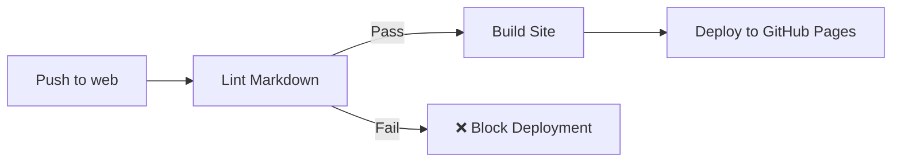

# Markdown Linting Guide

This project enforces markdown quality and consistency through automated linting.

## 🔍 Why Linting?

Markdown linting ensures:
- **Consistency** - All documentation follows the same style
- **Quality** - No broken links, malformed tables, or syntax errors
- **Readability** - Proper formatting improves comprehension
- **Deployment Safety** - Site won't deploy with broken markdown

## 📋 Linting Rules

The project uses [markdownlint](https://github.com/DavidAnson/markdownlint) with the following configuration:

### Enabled Rules

- **MD003** - Heading style must be ATX (`#` style)
- **MD004** - List style must use dashes (`-`)
- **MD007** - List indentation must be 2 spaces
- **MD024** - Duplicate headings allowed if siblings only
- **MD025** - Only one top-level heading per file
- **MD033** - HTML tags allowed (for tables, spans, etc.)
- **MD046** - Code blocks must use fenced style (```)

### Disabled Rules

- **MD013** - Line length (disabled for flexibility)
- **MD034** - Bare URLs allowed
- **MD041** - First line doesn't need to be heading

Full configuration is in [.markdownlint.json](.markdownlint.json)

## 🛠️ Available Commands

### Check for Issues

```bash
npm run lint:md
```

This will:
- Scan all markdown files in `src/lore/`
- Report any issues found
- Exit with error code 1 if issues exist

**Example Output:**

```
🔍 Starting markdown lint...

Found 7 markdown files to lint:

  - src/lore/concepts/alchematrix.md
  - src/lore/concepts/cultural-calendar.md
  ...

❌ Markdown linting failed!

Issues found:

📄 src/lore/concepts/society.md:
  Line 42: Multiple consecutive blank lines (MD012/no-multiple-blanks)
    Context: ""
  Line 58: Trailing spaces (MD009/no-trailing-spaces)
    Detail: Expected: 0; Actual: 2

❌ Linting failed with errors

To fix issues automatically where possible, run:
  npm run lint:md:fix
```

### Auto-Fix Issues

```bash
npm run lint:md:fix
```

This will:
- Automatically fix issues that can be fixed programmatically
- Report issues that require manual fixing
- Copy fixed files to `public/lore/`

**Example Output:**

```
🔧 Starting markdown auto-fix...

Found 7 markdown files:

✓ Loaded .markdownlint.json configuration

  ✓ Fixed: src/lore/concepts/society.md (2 issues)
  ⚠ Unable to auto-fix: src/lore/systems/weapons.md
    Line 15: Incorrect heading level

==================================================

📊 Summary:
  Total files: 7
  Fixed: 6
  Requires manual fix: 1

⚠️  Some issues require manual fixing
Run "npm run lint:md" to see remaining issues

📋 Copying fixed files to public/lore/...
✓ Files synchronized to public/lore/
```

### Lint All Code

```bash
npm run lint:all
```

This runs both JavaScript ESLint and Markdown linting.

## 🚀 CI/CD Integration

### Automated Checks

Every push to the `web` branch triggers:

1. **Lint Workflow** (`.github/workflows/lint.yml`)
   - Runs markdown linter
   - Must pass before deployment can proceed

2. **Deploy Workflow** (`.github/workflows/deploy.yml`)
   - Depends on successful lint job
   - Only runs if markdown linting passes
   - Builds and deploys the site

### Workflow Diagram



## 📝 Common Issues & Fixes

### Issue: Multiple blank lines

**Problem:**
```markdown
# Heading


Content here
```

**Fix:**
```markdown
# Heading

Content here
```

### Issue: Trailing spaces

**Problem:** Spaces at end of lines (invisible in editor)

**Fix:** Remove trailing spaces or use auto-fix

### Issue: Inconsistent list style

**Problem:**
```markdown
* Item 1
- Item 2
+ Item 3
```

**Fix:**
```markdown
- Item 1
- Item 2
- Item 3
```

### Issue: Incorrect heading levels

**Problem:**
```markdown
# Main Heading
### Skipped Level 2
```

**Fix:**
```markdown
# Main Heading
## Proper Level 2
### Level 3
```

### Issue: Bare URLs

**Allowed** - Configuration allows bare URLs:
```markdown
Check out https://example.com for more info
```

Both styles work:
```markdown
[Example](https://example.com)
https://example.com
```

## 🔧 Local Development

### Pre-commit Checks

Consider adding a pre-commit hook to check markdown:

```bash
# .git/hooks/pre-commit
#!/bin/sh
npm run lint:md
```

Make it executable:
```bash
chmod +x .git/hooks/pre-commit
```

### Editor Integration

#### VS Code

Install the **markdownlint** extension:
- Extension ID: `DavidAnson.vscode-markdownlint`
- Will show inline warnings/errors
- Supports auto-fix on save

Settings:
```json
{
  "markdownlint.config": {
    "extends": ".markdownlint.json"
  }
}
```

#### Other Editors

Most editors have markdownlint plugins available.

## 🐛 Troubleshooting

### Linter not finding files

**Check:**
- Files are in `src/lore/` directory
- Files have `.md` extension
- Run from project root

### False positives

If you encounter a rule that doesn't fit your use case:

1. Check if it's already disabled in `.markdownlint.json`
2. If not, consider adding an exception
3. Document the reason in this file

### Ignoring specific rules

To ignore a rule for a specific line:

```markdown
<!-- markdownlint-disable MD013 -->
This is a very long line that would normally trigger MD013 but is now ignored
<!-- markdownlint-enable MD013 -->
```

Or for the entire file:

```markdown
<!-- markdownlint-disable MD013 -->

# Content here with long lines...
```

## 📚 Resources

- [markdownlint Rules](https://github.com/DavidAnson/markdownlint/blob/main/doc/Rules.md)
- [Markdown Guide](https://www.markdownguide.org/)
- [CommonMark Spec](https://commonmark.org/)
- [GitHub Flavored Markdown](https://github.github.com/gfm/)

## 🎯 Best Practices

1. **Run linter before committing**
   ```bash
   npm run lint:md
   ```

2. **Fix issues automatically when possible**
   ```bash
   npm run lint:md:fix
   ```

3. **Keep markdown files in sync**
   - Edit in `src/lore/`
   - Copy to `public/lore/` after changes

4. **Test locally before pushing**
   ```bash
   npm run lint:all && npm run build
   ```

5. **Check CI status**
   - View workflow runs in GitHub Actions
   - Fix any failures before merging

---

Questions? Check the [markdownlint documentation](https://github.com/DavidAnson/markdownlint) or open an issue!
