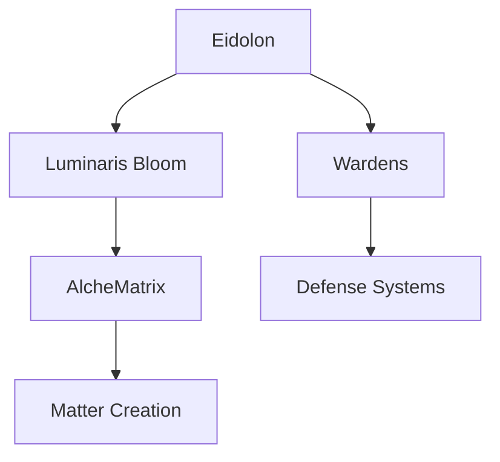

# Eidolon Line Lore Wiki - Setup Guide

## 🎉 What's Been Created

Your Eidolon Lore wiki is now a fully functional React + Vite application with:

### ✅ Complete Features
- ✨ Dark glassmorphic theme matching your design preferences
- 📚 All 7 lore pages converted from Notion to markdown
- 📊 Mermaid diagram support for visualizations
- 🧭 Responsive navigation with sidebar and breadcrumbs
- 📱 Mobile-friendly responsive design
- ⚡ Optimized for performance with Vite
- 🚀 Automatic GitHub Pages deployment configured

### 📁 Project Structure Created

```
Eidolon_Lore/
├── src/
│   ├── components/
│   │   ├── Layout.jsx & .css           # Main layout wrapper
│   │   ├── Navbar.jsx & .css           # Top navigation bar
│   │   ├── Sidebar.jsx & .css          # Side menu with lore index
│   │   ├── MarkdownRenderer.jsx & .css # Markdown + Mermaid renderer
│   │   └── MermaidDiagram.jsx & .css   # Mermaid diagram component
│   ├── pages/
│   │   ├── Home.jsx & .css             # Landing page
│   │   ├── LorePage.jsx & .css         # Individual lore page viewer
│   │   └── NotFound.jsx & .css         # 404 page
│   ├── data/
│   │   └── loreStructure.js            # Navigation structure data
│   ├── lore/                           # Original markdown files
│   │   ├── concepts/
│   │   ├── systems/
│   │   └── locations/
│   ├── App.jsx                         # Main app component
│   ├── main.jsx                        # Entry point
│   └── index.css                       # Global styles
├── public/
│   └── lore/                           # Public markdown files (for fetching)
│       ├── concepts/
│       ├── systems/
│       └── locations/
├── .github/
│   └── workflows/
│       └── deploy.yml                  # GitHub Actions deployment
├── index.html
├── vite.config.js
├── package.json
└── README.md
```

## 🚀 Getting Started

### Step 1: Install Dependencies

```bash
npm install
```

This will install:
- React & React DOM
- React Router for navigation
- React Markdown with plugins (GFM, rehype)
- Mermaid for diagrams
- Vite and development dependencies

### Step 2: Run Development Server

```bash
npm run dev
```

The site will be available at `http://localhost:5173`

### Step 3: Build for Production

```bash
npm run build
```

The optimized build will be in the `dist/` directory.

## 📊 Mermaid Diagrams

You can now add Mermaid diagrams to any markdown file:

````markdown

````

## 🚢 Deployment to GitHub Pages

### Automatic Deployment (Recommended)

The project is configured for automatic deployment:

1. **Enable GitHub Pages in your repository:**
   - Go to Settings → Pages
   - Source: GitHub Actions

2. **Push to master branch:**
   ```bash
   git add .
   git commit -m "Initial commit"
   git push origin master
   ```

3. **GitHub Actions will automatically:**
   - Build the project
   - Deploy to GitHub Pages
   - Site will be available at: `https://HueByte.github.io/Eidolon_Lore/`

### Manual Deployment

If you prefer manual deployment:

```bash
npm run build
# Upload contents of dist/ folder to your hosting provider
```

## 🎨 Customization

### Theme Colors

Edit `src/index.css` to change the color scheme:

```css
:root {
  --bg: #0f172a;           /* Background */
  --fg: #e2e8f0;           /* Foreground text */
  --accent: #38bdf8;       /* Accent color (cyan) */
  --accent-hover: #0ea5e9; /* Accent hover */
  --muted: rgba(148, 163, 184, 0.8);  /* Muted text */
  --border: rgba(148, 163, 184, 0.15); /* Borders */
}
```

### Adding New Lore Pages

1. **Create markdown file:**
   ```bash
   # Create in src/lore/{category}/
   touch src/lore/concepts/new-concept.md
   ```

2. **Copy to public:**
   ```bash
   cp src/lore/concepts/new-concept.md public/lore/concepts/
   ```

3. **Add to navigation:**
   Edit `src/data/loreStructure.js`:
   ```javascript
   concepts: [
     // ... existing entries
     { title: 'New Concept', path: 'new-concept' },
   ],
   ```

## 🔧 Configuration Notes

### Base URL

The app is configured for GitHub Pages with basename `/Eidolon_Lore/` in `App.jsx`:

```javascript
<Router basename="/Eidolon_Lore">
```

If you're deploying to a different URL, update this:
- Root domain: Change to `basename="/"`
- Different repo: Change to `basename="/your-repo-name"`

### Vite Config

The `vite.config.js` includes:
- React plugin
- Markdown asset handling
- Path aliases (`@` points to `/src`)

## 📝 Content Management

All lore content is in markdown format in two places:
- `src/lore/` - Source files for editing
- `public/lore/` - Public files for serving

**Important:** When editing lore, update both locations:
```bash
# Edit the file
vim src/lore/concepts/your-file.md

# Copy to public
cp src/lore/concepts/your-file.md public/lore/concepts/
```

## 🐛 Troubleshooting

### Issue: Pages not loading

- Check that markdown files are in `public/lore/` directory
- Verify paths in `src/data/loreStructure.js` match filenames (without .md extension)

### Issue: Mermaid diagrams not rendering

- Ensure code blocks use `mermaid` language identifier:
  ````markdown
  ```mermaid
  graph TD
      A --> B
  ```
  ````

### Issue: GitHub Pages 404

- Ensure repository Settings → Pages is set to "GitHub Actions"
- Check that workflow ran successfully in Actions tab
- Verify basename in `App.jsx` matches repository name

## 📚 Resources

- [React Documentation](https://react.dev/)
- [Vite Guide](https://vitejs.dev/guide/)
- [React Markdown](https://github.com/remarkjs/react-markdown)
- [Mermaid Syntax](https://mermaid.js.org/intro/)
- [GitHub Pages Deployment](https://docs.github.com/en/pages/getting-started-with-github-pages/creating-a-github-pages-site)

## 💡 Next Steps

1. **Test locally:** Run `npm run dev` and explore the site
2. **Customize theme:** Adjust colors and styles to your preference
3. **Add content:** Expand your lore with new pages
4. **Deploy:** Push to GitHub and enable Pages
5. **Share:** Share your lore wiki with the world!

---

Need help? Check the main README.md or open an issue!
